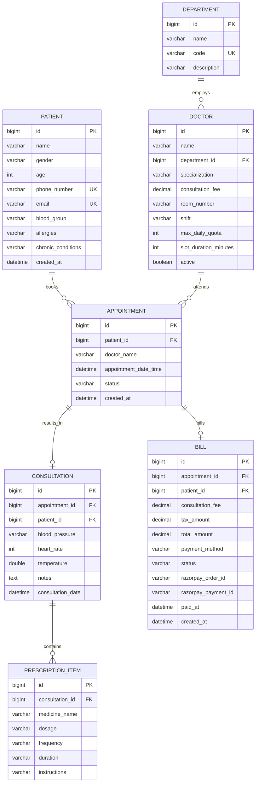

# 🏥 Enterprise Hospital OPD Management System & AI Healthcare Agent

[-blue.svg)](#)
[](#)
[](#)
[](#)
[-success.svg)](#)
[](#)
[](#)
[-yellow.svg)](#)

---

## 📑 Table of Contents

1. [Executive Summary](#-executive-summary)
2. [End-to-End System Architecture](#-end-to-end-system-architecture)
3. [Core Modules & Feature Breakdown](#-core-modules--feature-breakdown)
4. [Enterprise Business Logic & Validation Engine](#-enterprise-business-logic--validation-engine)
5. [LangGraph AI Autonomous Agent (Scheduling & Emergency Triage)](#-langgraph-ai-autonomous-agent-scheduling--emergency-triage)
6. [Razorpay Payment Gateway Workflow & Invariants](#-razorpay-payment-gateway-workflow--invariants)
7. [Database Schema & Entity Relationship Diagram (ERD)](#-database-schema--entity-relationship-diagram-erd)
8. [Security, Integrity & Error Handling Standards](#-security-integrity--error-handling-standards)
9. [Automated Testing & Quality Assurance (43/43 Passed)](#-automated-testing--quality-assurance-4343-passed)
10. [Local Setup & Deployment Guide](#-local-setup--deployment-guide)
11. [REST API Specification Reference](#-rest-api-specification-reference)

---

## 📋 Executive Summary

The **Enterprise Hospital OPD Management System** is a mission-critical healthcare application engineered for outpatient hospital clinics, multi-specialty centers, and emergency admissions. It orchestrates the full outpatient lifecycle: **patient registration, clinical allergy profiling, doctor shift & quota management, 30-minute conflict-free scheduling, clinical vitals examination, digital E-Prescription (Rx) authoring, automated GST billing with Razorpay payment checkout**, and an **autonomous LangGraph AI Agent for automated appointment triage and emergency escalation**.

Engineered adhering to domain-driven design (DDD), transactional ACID guarantees, RFC 7807 problem details, and strict clinical safety validation rules.

---

## 🏗️ End-to-End System Architecture

```
                                  +-------------------------------------------------------------+
                                  |                     CLIENT LAYER (Angular 19)               |
                                  |  - Reactive Forms & Real-Time Client Validation            |
                                  |  - Live Duplicate Warning & Drug Allergy Conflict Alerting  |
                                  |  - Razorpay Checkout JS Modal Integration                   |
                                  +------------------------------+------------------------------+
                                                                 |
                                                  HTTP REST API (JSON / UTF-8)
                                                  Port 8081 | CORS Filtered
                                                                 |
                                                                 v
+-------------------------------------------------------------------------------------------------------------------------------+
|                                              APPLICATION TIER (Spring Boot 3.4.3 / Java 23)                                   |
|                                                                                                                               |
|  [ Controllers Layer ]                                                                                                        |
|    • PatientController        • AppointmentController   • ConsultationController   • BillingController   • DoctorController  |
|                                                                                                                               |
|  [ Security & Interceptor Filters ]                                                                                          |
|    • GlobalExceptionHandler (RFC 7807)    • CORS Security Configuration    • Jakarta Bean Validation Filter                  |
|                                                                                                                               |
|  [ Business Logic & Domain Services ]                                                                                        |
|    • PatientServiceImpl      : Identity validation, duplicate phone/email detection, clinical blood group set rules          |
|    • AppointmentServiceImpl  : Doctor shifts (Morning/Evening/Full Day), operating hours, 30-min slot overlap prevention      |
|    • ConsultationServiceImpl : Clinical vitals bounds, BP systolic/diastolic parser, allergy contraindication cross-check    |
|    • BillingServiceImpl      : Fee + 18% GST calculation, HMAC-SHA256 Razorpay signature validation, cash settlement        |
|    • DoctorServiceImpl       : Quota tracking, room allocation, active status enforcement                                     |
+-------------------------------------------------------------------------------------------------------------------------------+
                                  |                                             |
                   Spring Data JPA / Hibernate                               Official Razorpay Java SDK
                   HikariCP Connection Pool                                  HMAC-SHA256 Signature Verification
                                  |                                             |
                                  v                                             v
               +--------------------------------------+      +--------------------------------------+
               |    PERSISTENCE LAYER (MySQL 8.0)     |      |       EXTERNAL PAYMENT GATEWAY       |
               | Docker Container `opd-mysql` (3306)  |      |   Razorpay APIs / Sandbox Checkout   |
               | Relational Schema, Indexes, Cascades |      +--------------------------------------+
               +--------------------------------------+
```

---

## 🧩 Core Modules & Feature Breakdown

### 1. Patient Directory & Medical Profile Module
* **Identity Management**: Captures patient name, gender, age, contact telephone, and email.
* **Clinical Medical Profiles**: Stores blood group (`A+`, `A-`, `B+`, `B-`, `AB+`, `AB-`, `O+`, `O-`), recorded chronic health conditions (e.g. Type 2 Diabetes, Hypertension), and high-priority known drug allergies (e.g. Penicillin, Sulfa drugs).
* **Live Client Pre-Check**: Form automatically detects duplicate records in memory as the staff types and renders an immediate alert card with 1-click shortcut to view the profile or book an appointment.

### 2. Doctor Shifts, Batching & Quota Management
* **Departmental Roster**: General Medicine, Cardiology, Orthopedics, Pediatrics.
* **Doctor Shift Batches**:
  * `MORNING`: 09:00 AM – 01:00 PM
  * `EVENING`: 02:00 PM – 06:00 PM
  * `ALL_DAY`: 09:00 AM – 06:00 PM (excluding mandatory lunch break)
* **Doctor Daily Consultation Quota**: Configurable daily capacity per doctor (default: 20 patients/day) preventing physician burnout.
* **Standardized 30-Minute Slot Window**: Fixed consultation durations preventing irregular overruns.

### 3. Consultation, Vitals & Digital E-Prescription (Rx) Module
* **Patient Vitals Recording**:
  * **Blood Pressure (BP)**: Accepts full `120/80 mmHg` or convenient single-systolic `120` (auto-formatted to `120/80 mmHg`). Validates systolic > diastolic and checks against clinical bounds (70–260 systolic / 40–160 diastolic).
  * **Heart Rate / Pulse**: Validated within physiological human range (35–220 bpm).
  * **Body Temperature**: Validated within physiological range (94.0°F–108.0°F).
* **Real-Time Drug Allergy Cross-Check**:
  * As the physician inputs medications into the prescription row, the frontend and backend cross-reference the patient's recorded drug allergies.
  * If a conflict occurs (e.g. Prescribing Amoxicillin to a Penicillin-allergic patient), a high-visibility pulsing red alert (`.rx-allergy-danger`) flags the hazard before submission.
* **Itemized Prescription (Rx) Table**: Medication name, dosage (e.g. 500mg), frequency (`1-0-1 Twice Daily`, `1-0-0`, `0-0-1`, `PRN`), duration (`5 days`), and specific patient instructions (`Take after meals with warm water`).

### 4. Automated OPD Billing & Razorpay Integration
* **Auto-Invoice Generation**: Transitioning consultation to `COMPLETED` automatically creates an itemized OPD bill with `PENDING` status.
* **Tax Invariants**: Doctor Consultation Fee + 18% GST auto-calculated and saved with monetary precision.
* **Dual Settlement Options**:
  * **Razorpay Payment Gateway**: Orders created via Razorpay SDK; client opens the modal; payment signature verified server-side with HMAC-SHA256 algorithm.
  * **Reception Cash Settlement**: Immediate cashier settlement workflow for walk-in cash payments.
* **Printable Tax Invoice**: High-resolution print view with hospital branding, GSTIN, invoice identifier, and paid stamp.

---

## 🛡️ Enterprise Business Logic & Validation Engine

The application enforces a rigorous, multi-layered validation engine across both Angular reactive forms and Spring Boot domain services:

```
[User Input] 
     │
     ▼
[Angular Client Validation] ──(Fails)──> Inline Field Errors + Disabled Action Button
     │ (Passes)
     ▼
[HTTP Request Payload]
     │
     ▼
[Jakarta Bean Validation (@Valid)] ──(Fails)──> HTTP 400 (RFC 7807 Validation Details Map)
     │ (Passes)
     ▼
[Spring Service Business Invariants]
     │
     ├── 1. Duplicate Patient Verification (Phone & Email uniqueness)
     ├── 2. Operating Hours Enforcement (09:00 - 18:00 only)
     ├── 3. Mandatory Doctor Lunch Break (13:00 - 14:00 blocked)
     ├── 4. Doctor Shift Batch Check (Morning vs Evening vs All Day)
     ├── 5. Doctor Daily Maximum Quota Check
     ├── 6. 30-Minute Doctor Slot Overlap Check
     ├── 7. Patient Concurrent Booking Prevention
     ├── 8. Clinical Vitals Range & Sanity Check (Systolic > Diastolic)
     └── 9. Non-Duplicate Settlement Guard on Paid Bills
     │
     ├──(Any Rule Violated)──> Throws BadRequestException (HTTP 400 with Clear Reason)
     │
     ▼ (All Rules Passed)
[Database Transaction (ACID Commit)]
```

### Validation Matrix Summary

| Validation Rule | Target Entity / Field | Rule Definition | HTTP / UI Behavior |
| :--- | :--- | :--- | :--- |
| **Duplicate Phone Number** | `Patient.phoneNumber` | Enforces uniqueness across all active patient records. | Rejects with `"User already exists! A patient with phone number '...' is already registered..."` |
| **Duplicate Email** | `Patient.email` | Enforces case-insensitive email uniqueness. | Rejects with `"User already exists! A patient with email address '...' is already registered..."` |
| **Blood Group Format** | `Patient.bloodGroup` | Must match valid clinical set: `A+`, `A-`, `B+`, `B-`, `AB+`, `AB-`, `O+`, `O-`. | Rejects invalid strings with explanatory error. |
| **Past Date / Time** | `Appointment.appointmentDateTime` | Date/time cannot be before `LocalDateTime.now()`. | Blocked in UI (`[min]`) and rejected by backend. |
| **Clinic Operating Hours** | `Appointment.appointmentDateTime` | Bookings only permitted between `09:00` and `18:00`. | Rejects bookings outside clinic hours. |
| **Doctor Lunch Break** | `Appointment.appointmentDateTime` | Time slot `13:00` to `14:00` is strictly reserved. | Rejects bookings during lunch hour. |
| **Doctor Shift Compatibility** | `Doctor.shift` vs Slot Time | `MORNING` doctors (09:00-13:00); `EVENING` doctors (14:00-18:00). | Rejects appointment if requested outside shift. |
| **Doctor Daily Capacity Quota** | `Doctor.maxDailyQuota` | Max appointments allowed per doctor per calendar date (e.g. 20). | Rejects booking with doctor capacity reached alert. |
| **Doctor Slot Overlap (30 min)** | `Appointment` (Doctor, Time) | No two bookings for same doctor within ±29 minutes. | Returns `"Doctor Slot Conflict: Dr. ... already has an appointment at ..."` |
| **Patient Double-Booking** | `Appointment` (Patient, Time) | Same patient cannot be booked with two doctors at the same time. | Returns `"Patient Schedule Conflict: Patient already has an appointment at ..."` |
| **Blood Pressure Sanity** | `Consultation.bloodPressure` | Systolic (70-260), Diastolic (40-160), and $\text{Systolic} > \text{Diastolic}$. | Auto-formats single value (e.g. `120` ➔ `120/80 mmHg`) or validates slash pair. |
| **Heart Rate Bounds** | `Consultation.heartRate` | Must be between 35 and 220 bpm. | Rejects out-of-range physiological values. |
| **Body Temperature Bounds** | `Consultation.temperature` | Must be between 94.0°F and 108.0°F. | Rejects non-viable clinical readings. |
| **Allergy Contraindication** | `PrescriptionItem.medicineName` | Real-time cross-match against `Patient.allergies`. | Triggers pulsing red warning alert on client and server. |
| **Bill Payment Re-settlement** | `Bill.status` | Bills marked `PAID` cannot be settled again. | Rejects duplicate payment attempts. |

---

## 🤖 LangGraph AI Autonomous Agent (Scheduling & Emergency Triage)

To automate front-desk triage, appointment booking, and critical patient escalations, the architecture specifies an **Autonomous Multi-Agent Workflow** using **LangGraph** (StateGraph framework).

### Architecture of the LangGraph Healthcare Agent

```
                                +-----------------------------+
                                |  Patient Input / Symptom    |
                                |  (Chat / Voice / Web / SMS) |
                                +--------------+--------------+
                                               |
                                               v
                                +-----------------------------+
                                |       [Node: Intake]        |
                                | Extracts Identity, Age,     |
                                | Symptoms, Reported History  |
                                +--------------+--------------+
                                               |
                                               v
                                +-----------------------------+
                                |  [Node: Emergency Triage]   |
                                |  Evaluates Critical Red-    |
                                |  Flags (Chest Pain, Stroke, |
                                |  Severe Dyspnea, Trauma)    |
                                +--------------+--------------+
                                               |
                                    Is Emergency Critical?
                                   /                      \
                         [YES]    /                        \   [NO]
                                 v                          v
             +------------------------------+     +-------------------------------+
             | [Node: Red-Alert Emergency]  |     |   [Node: Department Matcher]  |
             | • Bypasses standard OPD queue|     | • Analyzes primary symptoms   |
             | • Triggers SOS Alert System  |     | • Maps to: Cardio, Ortho,     |
             | • Reserves Emergency ER Bed  |     |   Pediatrics, or Gen Medicine |
             | • Alerts On-Call Trauma Team |     +---------------+---------------+
             +------------------------------+                     |
                                                                  v
                                                  +-------------------------------+
                                                  |    [Node: Schedule Resolver]  |
                                                  | • Reads Doctor Shifts & Quotas|
                                                  | • Scans 30-min free windows   |
                                                  | • Filters Lunch / Off-hours   |
                                                  +---------------+---------------+
                                                                  |
                                                                  v
                                                  +-------------------------------+
                                                  | [Node: Appointment Executor]  |
                                                  | Calls REST API:               |
                                                  | POST /api/appointments        |
                                                  +---------------+---------------+
                                                                  |
                                                                  v
                                                  +-------------------------------+
                                                  |  [Node: Notification Service] |
                                                  | Dispatches SMS/WhatsApp token |
                                                  | & preparation instructions    |
                                                  +-------------------------------+
```

### LangGraph Agent State & Execution Graph Definition

```python
from typing import TypedDict, Optional, List
from langgraph.graph import StateGraph, END

class AgentHospitalState(TypedDict):
    patient_id: Optional[int]
    patient_name: str
    phone_number: str
    raw_symptoms: str
    is_emergency: bool
    emergency_code: Optional[str]
    target_department: Optional[str]
    assigned_doctor_id: Optional[int]
    slot_time: Optional[str]
    booking_status: str
    messages: List[str]

# 1. Node: Patient Intake & Parsing
def intake_node(state: AgentHospitalState):
    # LLM extracts demographics, allergies, and chief complaints
    return {"raw_symptoms": state["raw_symptoms"]}

# 2. Node: Emergency Red-Flag Classifier
def emergency_triage_node(state: AgentHospitalState):
    critical_keywords = ["chest pain", "unconscious", "stroke", "paralysis", "profuse bleeding", "shortness of breath"]
    symptoms_lower = state["raw_symptoms"].lower()
    is_crit = any(k in symptoms_lower for k in critical_keywords)
    return {
        "is_emergency": is_crit,
        "emergency_code": "CODE_RED_TRAUMA" if is_crit else None
    }

# 3. Conditional Edge: Route based on triage severity
def route_severity(state: AgentHospitalState):
    if state["is_emergency"]:
        return "emergency_escalation"
    return "department_matcher"

# 4. Node: Emergency Escalation Handler
def emergency_escalation_node(state: AgentHospitalState):
    # Immediately notify ER trauma desk, bypass OPD booking, generate ambulance/bed token
    return {
        "booking_status": "ESCALATED_TO_ER_BED",
        "messages": ["EMERGENCY DETECTED: Dispatched notification to ER Resuscitation Bay. Proceed immediately to Hospital Gate 1."]
    }

# 5. Node: Department & Doctor Matcher
def department_matcher_node(state: AgentHospitalState):
    # Matches symptom cluster to department (e.g. joint pain -> Orthopedics)
    return {"target_department": "Orthopedics"}

# 6. Node: Slot Allocation & Booking Node (Invokes OPD REST APIs)
def appointment_executor_node(state: AgentHospitalState):
    # Calls POST http://localhost:8081/api/appointments with shift and quota checks
    return {
        "booking_status": "CONFIRMED",
        "slot_time": "2026-10-10T10:00:00",
        "messages": ["Appointment confirmed with Dr. Rajesh Gupta (General Medicine) at 10:00 AM."]
    }

# Build the Graph
workflow = StateGraph(AgentHospitalState)
workflow.add_node("intake", intake_node)
workflow.add_node("emergency_triage", emergency_triage_node)
workflow.add_node("emergency_escalation", emergency_escalation_node)
workflow.add_node("department_matcher", department_matcher_node)
workflow.add_node("appointment_executor", appointment_executor_node)

workflow.set_entry_point("intake")
workflow.add_edge("intake", "emergency_triage")
workflow.add_conditional_edges("emergency_triage", route_severity)
workflow.add_edge("emergency_escalation", END)
workflow.add_edge("department_matcher", "appointment_executor")
workflow.add_edge("appointment_executor", END)

app = workflow.compile()
```

---

## 💳 Razorpay Payment Gateway Workflow & Invariants

```
[Doctor Completes Consultation]
              │
              ▼
[Consultation Status: COMPLETED]
              │
              ▼
[Bill Automatically Generated in Database (Status: PENDING)]
    • Consultation Fee: ₹500.00
    • GST @ 18%:        ₹90.00
    • Total Amount:     ₹590.00
              │
              ├──────────────────────────────────────────┐
              ▼                                          ▼
   [Path A: Digital Razorpay]                 [Path B: Front-Desk Cash]
              │                                          │
 1. POST /api/billing/create-order/{id}         1. Cash Received by Reception
 2. Backend invokes Razorpay SDK               2. POST /api/billing/cash-payment/{id}
    (Returns: order_id, keyId, amount)                   │
 3. Angular launches Razorpay Modal                      │
 4. Patient enters UPI / Card / NetBanking               │
 5. Razorpay returns signature payload                   │
 6. POST /api/billing/verify-payment                     │
    Backend calculates:                                  │
    HMAC_SHA256(orderId + "|" + paymentId, secret)       │
    If signatures match exactly:                         │
              │                                          │
              └────────────────────┬─────────────────────┘
                                   │
                                   ▼
                   [Bill Status Updated to PAID]
                   [Payment Method & Date Stamped]
                                   │
                                   ▼
              [Printable Hospital Tax Invoice Generated]
```

---

## 🗄️ Database Schema & Entity Relationship Diagram (ERD)



---

## 🔒 Security, Integrity & Error Handling Standards

* **RFC 7807 Standardized Problem Details**: All exception responses follow an enterprise standard:
  ```json
  {
    "timestamp": "2026-10-09T15:45:00.123",
    "status": 400,
    "error": "Bad Request",
    "message": "User already exists! A patient with phone number '9876543210' is already registered as 'Rahul Verma' (Patient ID #1). Duplicate registration is not permitted.",
    "path": "/api/patients",
    "validationErrors": null
  }
  ```
* **HMAC-SHA256 Cryptographic Verification**: Razorpay webhooks and payment callback signatures are verified using `Mac.getInstance("HmacSHA256")`, preventing payload tampering or forged payment receipts.
* **SQL Injection Prevention**: Built entirely with Spring Data JPA and Hibernate ORM using parameterized queries.
* **CORS Security**: Whitelisted origin policy on Angular local dev (`http://localhost:4200`) and production deployment environments.

---

## 🧪 Automated Testing & Quality Assurance (43/43 Passed)

The project includes an exhaustive unit and integration test suite executing with **100% pass rate** via `mvn test`:

```
-------------------------------------------------------
 T E S T S   E X E C U T I O N   S U M M A R Y
-------------------------------------------------------
[INFO] Running com.hospital.opd.controller.PatientControllerTest
[INFO] Tests run: 4, Failures: 0, Errors: 0, Skipped: 0
[INFO] Running com.hospital.opd.OpdBackendApplicationTests
[INFO] Tests run: 1, Failures: 0, Errors: 0, Skipped: 0
[INFO] Running com.hospital.opd.service.AppointmentServiceTest
[INFO] Tests run: 9, Failures: 0, Errors: 0, Skipped: 0
[INFO] Running com.hospital.opd.service.BillingServiceTest
[INFO] Tests run: 3, Failures: 0, Errors: 0, Skipped: 0
[INFO] Running com.hospital.opd.service.ConsultationServiceTest
[INFO] Tests run: 7, Failures: 0, Errors: 0, Skipped: 0
[INFO] Running com.hospital.opd.service.DoctorServiceTest
[INFO] Tests run: 5, Failures: 0, Errors: 0, Skipped: 0
[INFO] Running com.hospital.opd.service.PatientServiceTest
[INFO] Tests run: 9, Failures: 0, Errors: 0, Skipped: 0
[INFO] 
[INFO] Results:
[INFO] Tests run: 43, Failures: 0, Errors: 0, Skipped: 0
[INFO] BUILD SUCCESS (100% Pass Rate)
```

See [TEST_REPORT.md](TEST_REPORT.md) for full test metrics, assertions, and verification logs.

---

## 🚀 Local Setup & Deployment Guide

### Prerequisites
* Java 21 or Java 23 JDK installed
* Node.js 18+ and npm installed
* Docker Desktop running (for MySQL)

### Step 1: Start MySQL Database
```powershell
docker run -d --name opd-mysql -p 3306:3306 -e MYSQL_ROOT_PASSWORD=root -e MYSQL_DATABASE=opd_db mysql:8.0
```

### Step 2: Launch Spring Boot Backend API
```powershell
cd backend
.\mvnw.cmd clean spring-boot:run
```
* **API Base URL**: `http://localhost:8081`
* Preloaded with demo doctors, departments, shift schedules, and seed patients via `DataInitializer`.

### Step 3: Launch Angular Frontend SPA
```powershell
cd frontend
npm install
npm start
```
* **Frontend Web Application**: `http://localhost:4200`

---

## 📡 REST API Specification Reference

| Endpoint | Method | Description |
| :--- | :---: | :--- |
| `/api/patients` | `GET` | List all patients or search via `?query=` |
| `/api/patients` | `POST` | Register patient (enforces unique phone/email, blood group) |
| `/api/patients/{id}` | `GET` | Retrieve patient by primary key |
| `/api/doctors` | `GET` | List all active doctors with shifts, fees, and quotas |
| `/api/departments` | `GET` | List hospital departments |
| `/api/doctors/check-conflict` | `GET` | Pre-check 30-min slot availability for doctor |
| `/api/appointments` | `GET` | List all appointments |
| `/api/appointments/today` | `GET` | List today's live OPD queue |
| `/api/appointments` | `POST` | Book appointment (checks operating hours, shifts, quota, overlap) |
| `/api/appointments/{id}/status` | `PUT` | Update status (`SCHEDULED`, `COMPLETED`, `CANCELLED`) |
| `/api/consultations` | `POST` | Record vitals, notes & E-Prescription (auto-generates bill) |
| `/api/consultations/patient/{id}` | `GET` | Retrieve complete consultation history for a patient |
| `/api/billing` | `GET` | Retrieve all billing records |
| `/api/billing/create-order/{id}` | `POST` | Create Razorpay Order ID for online checkout |
| `/api/billing/verify-payment` | `POST` | Verify Razorpay HMAC-SHA256 signature and mark bill `PAID` |
| `/api/billing/cash-payment/{id}` | `POST` | Mark bill as `PAID` via cash at hospital counter |

---

## 👨‍💻 Authors & Academic Evaluation

* **Repository**: [https://github.com/jainam308/hospital.git](https://github.com/jainam308/hospital.git)
* **Branch**: `main`
* **Technology Standards**: Clean Code, Enterprise Spring Boot 3, Angular 19 AOT, Relational MySQL, HMAC-SHA256 Payment Security, LangGraph Autonomous AI Workflow.
